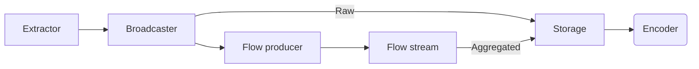

# Wikipedia data processing

Personal project to get familiar with, apply and evalutate Elixir libraries for Data Engineering tasks.

The data source is [Wikipedia's recent changes API](https://www.mediawiki.org/wiki/API:RecentChanges).

### Topology



### Commands

Manually capture data to local storage
```elixir
iex> {:ok, pid} = Extraction.Storage.GenServer.start_link(%{storage: Extraction.Storage.S3, formatter: Extraction.Storage.Formatter.Json})
iex> Extraction.Sse.stream_sse("https://stream.wikimedia.org/v2/stream/recentchange", &Extraction.Sse.process_sse/2)
```

Run livebook
```bash
docker run --network wikipedia_data_processing_network -p 8080:8080 -p 8081:8081 --pull always -u $(id -u):$(id -g) -v $(pwd)/data_exploration:/data ghcr.io/livebook-dev/livebook
```

Garage
```
node_id=$(docker exec -ti garage /garage status | awk 'END {print $1}')
docker exec -it garage /garage layout assign -z dc1 -c 1G $node_id
docker exec -it garage /garage layout apply --version 1
docker exec -it garage /garage bucket create testbucket
mapfile -t lines < <(docker exec -it garage /garage key create testbucket_key | awk 'NR==4 || NR==6 { print $3 }')
key_id=${lines[0]}
secret_key=${lines[1]}
docker exec -it garage /garage bucket allow --read --write --owner testbucket --key testbucket_key
echo "export AWS_ACCESS_KEY_ID=$key_id"
echo "export AWS_SECRET_ACCESS_KEY=$secret_key"
```

Load environment without starting app
```bash
iex -S mix run --no-start
```

### Known issues

Connection gets dropped reliably every 15 minutes until Req runs out of retries.
```elixir
23:46:31.845 [warning] retry: got exception, will retry in 1000ms, 3 attempts left

23:46:31.847 [warning] ** (Req.TransportError) socket closed

00:01:33.768 [warning] retry: got exception, will retry in 2000ms, 2 attempts left

00:01:33.768 [warning] ** (Req.TransportError) socket closed

00:16:36.754 [warning] retry: got exception, will retry in 4000ms, 1 attempt left

00:16:36.754 [warning] ** (Req.TransportError) socket closed
** (Req.TransportError) socket closed
    (req 0.5.10) lib/req.ex:1121: Req.request!/2
    iex:1: (file)
```

---

Ocasionally the data received can't be parsed by `ServerSentEvents.parse_field/2`.

```elixir
22:05:45.310 [error] GenServer Extraction.Sse.GenServer terminating
** (FunctionClauseError) no function clause matching in ServerSentEvents.parse_field/2
    (server_sent_events 0.2.1) lib/server_sent_events.ex:100: ServerSentEvents.parse_field(<<130, 208, 184, 58, 208, 161, 209, 130, 208, 176, 209, 130, 208, 184, 209, 129, 209, 130, 208, 184, 208, 186, 208, 176, 32, 209, 129, 209, 130, 209, 128, 208, 176, 208, 189, 208, 184, 209, 134, 47, 208, 154, 208, 190, 208, 188, 208, 188, 208, 181, ...>>, [])
    (server_sent_events 0.2.1) lib/server_sent_events.ex:68: ServerSentEvents.parse_event/2
    (server_sent_events 0.2.1) lib/server_sent_events.ex:40: ServerSentEvents.parse/2
    (extraction 0.1.0) lib/extraction/sse.ex:12: Extraction.Sse.process_sse/2
    (finch 0.19.0) lib/finch/http1/conn.ex:346: Finch.HTTP1.Conn.receive_response/8
    (finch 0.19.0) lib/finch/http1/conn.ex:131: Finch.HTTP1.Conn.request/8
    (finch 0.19.0) lib/finch/http1/pool.ex:60: anonymous fn/10 in Finch.HTTP1.Pool.request/6
    (nimble_pool 1.1.0) lib/nimble_pool.ex:462: NimblePool.checkout!/4
Last message: {:continue, :stream}
State: []
```